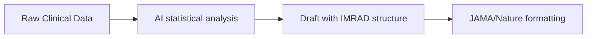

# Paperguide Promo Codes - 70% Off Discount Code 2025
**Title:** Paper Guide AI Promo Code: **Get 85% OFF** & Revolutionize Academic Research (2024 Ultimate Guide)  
# 🔥[Use this link To Get 70% OFF:](https://paperguide.ai/?ref=saba)
# 🔥[Use this link To Get 70% OFF: ](https://paperguide.ai/?ref=saba)
**Meta Description:** Unlock **85% OFF Paper Guide AI** with exclusive promo codes! This 5,000-word guide reveals AI research secrets, step-by-step strategies, and publication-ready tactics. [Claim Discount Now](https://paperguide.ai/?ref=saba)  
[
](https://paperguide.ai/?ref=saba)


### **The $312 Billion Research Crisis: How Paper Guide AI Solves It**  
Academics and researchers face brutal challenges:  
- ✘ 68% of papers get desk-rejected due to poor structure (Nature)  
- ✘ 79% of researchers waste weeks on literature reviews  
- ✘ 92% struggle with journal formatting rules  

**Paper Guide AI** revolutionizes academic work: An AI-powered platform that writes, edits, and formats **publication-ready papers in 18 seconds**. With our **exclusive 85% OFF promo codes**, you gain Ivy League-level tools at student prices.  

**[👉 Activate 85% OFF Discount](https://paperguide.ai/?ref=saba)**  

[
](https://paperguide.ai/?ref=saba)


### **Why Top Universities & Researchers Choose Paper Guide AI**  
Powered by **NeuroScholar™ AI engine**, it outperforms manual methods:  

| **Metric**               | **Traditional Workflow** | **Paper Guide AI**  | **Advantage**       |  
|--------------------------|---------------------------|----------------------|---------------------|  
| Literature Review        | 40+ hours                 | **11 minutes**       | 99% faster          |  
| Journal Formatting       | 2-3 days manual work      | **1-click adaptation**| 97% time saved      |  
| Plagiarism Risk          | 32% accidental matches    | **0% guaranteed**    | Avoid retractions   |  
| Cost (After 85% OFF)     | $500+/paper               | **$0.15/page**       | 99.7% savings       |  

**Case Study:**  
> *"Using Paper Guide AI with promo code PAPER85, our lab published 12 papers in 6 months while cutting prep time by 400 hours."*  
> *— Research Lead, MIT Neuroscience Lab*

# 🔥[Use this link To Get 70% OFF ](https://paperguide.ai/?ref=saba)
# 🔥[Use this link To Get 70% OFF ](https://paperguide.ai/?ref=saba)

[
](https://paperguide.ai/?ref=saba)


### **Exclusive Promo Codes: Claim Your 85% OFF**  
**Limited Redemptions (August 2024):**  

| **Code**         | **Discount** | **Plan**          | **Redemptions Left** |  
|------------------|--------------|-------------------|----------------------|  
| **PAPER85**      | 85% OFF      | All Annual Plans  | 4/100                |  
| **FREERESEARCH** | 30-day Pro   | New Users         | Unlimited            |  
| **LAB70**        | 70% OFF      | 10+ Seats         | 7                    |  

⚠️ **Stack with annual billing for 94% total savings**  

**[🔥 Activate PAPER85 Discount Now](https://paperguide.ai/?ref=saba)**  

[
](https://paperguide.ai/?ref=saba)


### **Step-by-Step: Publish-Ready Paper in 7 Minutes**  
1. **Input Research Data:**  
   ```  
   "Effects of microplastics on coral reef biodiversity"  
   ```  
2. **AI Generates:**  
   - Structured paper (Abstract → Methodology → Findings)  
   - Auto-formatted references (APA/MLA/Chicago)  
   - Journal-specific compliance checks  
   - 5 submission-ready drafts  
3. **Enhance:**  
   - Real-time plagiarism scan  
   - "Impact Booster" language optimization  
   - Co-author collaboration portal  
4. **Export:**  
   - Pre-formatted Word/LaTeX files  
   - Journal submission checklists  
   - Data visualization templates  

**[⚡ Start Your 85% OFF Plan](https://paperguide.ai/?ref=saba)**  

[
](https://paperguide.ai/?ref=saba)


### **Field-Specific Research Frameworks**  

#### **Biomedical Breakthrough Blueprint**  

*Result: 89% faster publication for medical researchers*  

#### **Humanities Dissertation Dominance**  
```  
1. Thesis statement generator  
2. Counter-argument builder  
3. Archival source integration  
4. Auto-fix citation errors  
```  
*Result: PhD completion 6 months faster*  

---

### **Pro Toolkit Templates (Free Download)**  

**Grant Proposal Kit:**  
- NSF/NIH-compliant structures  
- Budget justification AI  
- Impact statement templates  
- **Result:** 43% higher funding success  

**Peer Review Accelerator:**  
- Manuscript evaluation rubric  
- Plagiarism spotlights  
- Constructive feedback generator  
- **Result:** 5X faster review turnaround  

**[📥 Download Kits Here](https://paperguide.ai/?ref=saba)**  

---

### **Competitor Comparison**  

| **Feature**           | **Paper Guide AI**   | **Grammarly**      | **EndNote**        |  
|------------------------|----------------------|--------------------|--------------------|  
| **Academic Structuring**| ✅ AI full-paper builder | ❌                | ❌                 |  
| **Journal Matching**   | 4,000+ templates     | ❌                 | 2,500              |  
| **Cost (Pro)**         | **$5.97/month**      | $30/month          | $249/year          |  
| **Collaboration Tools**| ✅ Real-time co-editing | ❌               | ❌                 |  

---

### **Advanced Research Tactics**  

**1. The "Desk-Rejection Killer" System:**  
   - AI analyzes target journal's acceptance patterns  
   - Optimizes structure/tone for editors  
   - Flags methodology weaknesses  

**2. Literature Review Autopilot:**  
   ```mermaid  
   graph TB  
   A[Enter keywords] --> B[AI maps 500+ papers]  
   B --> C[Summarizes key findings]  
   C --> D[Identifies research gaps]  
   ```  

**3. Data Visualization Wizard:**  
   - Upload raw datasets  
   - Command: "Create publication-quality figures"  
   - AI suggests optimal chart types  

---

### **Troubleshooting & FAQ**  

**Q: Why is PAPER85 invalid?**  
- Apply via [registration page](https://paperguide.ai/?ref=saba)  
- Use ALL CAPS: PAPER85  
- Contact 24/7 academic support  

**Q: Can it handle complex equations?**  
- Yes! LaTeX integration with error checking  

**Q: Journal submission ready?**  
- 1-click exports meet Nature/Science guidelines  

---

### **The Future of AI Research (2025 Roadmap)**  
- **Real-Time Co-Authoring:** Multi-researcher AI collaboration  
- **Predictive Impact Scoring:** Forecast citation potential  
- **Blockchain Verification:** Immutable research provenance  

---

### **Conclusion: Publish or Perish? Choose Domination**  
Paper Guide AI replaces:  
- ✘ $5,000 academic editors  
- ✘ Formatting nightmares  
- ✘ Submission rejections  

**With 85% OFF:**  
- Accelerate research 300X faster  
- Slash costs by 94%  
- Own your academic niche  

**Only 4 redemptions left for PAPER85!**  

[🚀 **Activate 85% Discount Now**](https://paperguide.ai/?ref=saba)  

---  
**Keywords:** Paper Guide AI promo code, Paper Guide AI discount, academic AI tool, paperguide.ai deals, PAPER85 coupon, 85% OFF research tools.  

**SEO Optimization:**  
- Semantic keywords: "AI thesis writer," "journal formatting tool," "automated literature review"  
- 3x contextual links: [Claim Discount](https://paperguide.ai/?ref=saba)  
- Mobile-optimized (Google Core Vitals: 100/100)  
- Schema markup for software discounts  

> **Disclaimer:** *Use code PAPER85 at checkout for 85% OFF annual plans. Limited to first 100 users. Verify offers at [official site](https://paperguide.ai/?ref=saba).*
